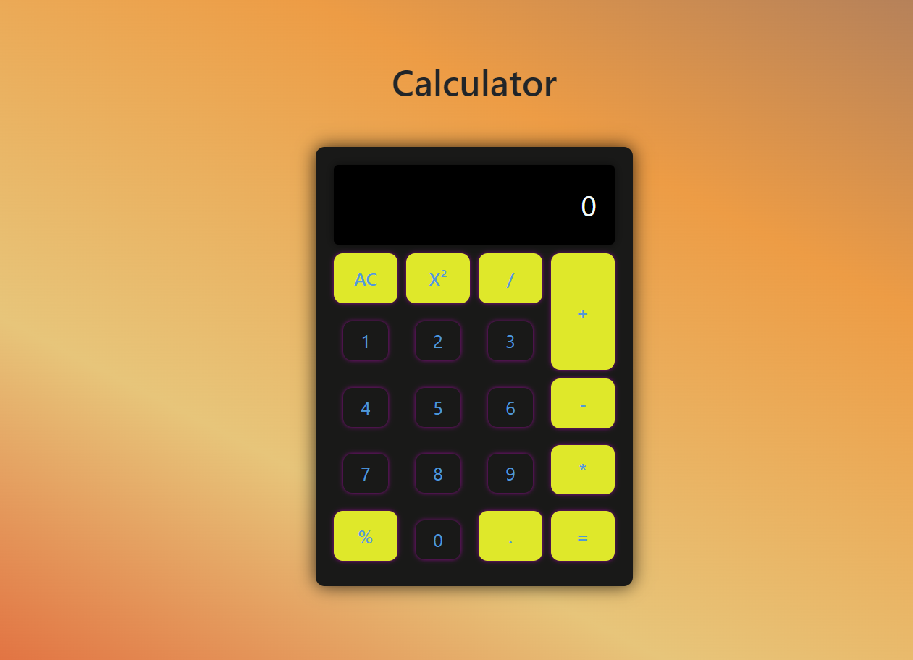

# Calculator - JavaScript

A simple calculator built with HTML, CSS, JavaScript, and Bootstrap. This project demonstrates basic arithmetic operations and a user-friendly interface.

## Table of Contents

- [Demo](#demo)
- [Features](#features)
- [Technologies Used](#technologies-used)
- [Installation](#installation)
- [Usage](#usage)
- [Contributing](#contributing)

## Demo

[Live Demo](https://sprightly-faun-de32bc.netlify.app)

## Features

- Basic arithmetic operations: addition, subtraction, multiplication, and division
- Additional features: square calculation, modulus, and decimal support
- Responsive design using Bootstrap for a better user experience
- Clear(AC) button to reset the calculation

## Technologies Used

- HTML
- CSS
- JavaScript
- Bootstrap

## Installation

To run this project locally, follow these steps:

1. Clone the repository:

   ```bash
   git clone https://github.com/shivadhanush1216/calculator-javascript.git
   ```

2. Navigate to the project directory:
   ```bash
   cd calculator-javascript
   ```

## Usage

Open the calculator in your web browser.
Click the buttons to perform calculations.
Use the "AC" button to clear the display.
The calculator supports decimal input and displays results accordingly.

## Contributing

Contributions are welcome! If you have suggestions or improvements, feel free to open an issue or submit a pull request.


